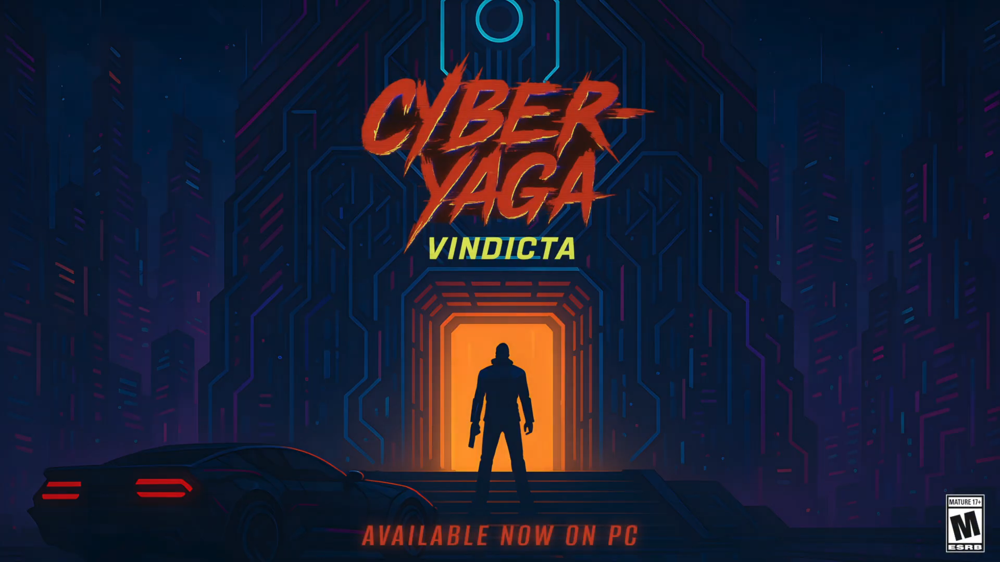
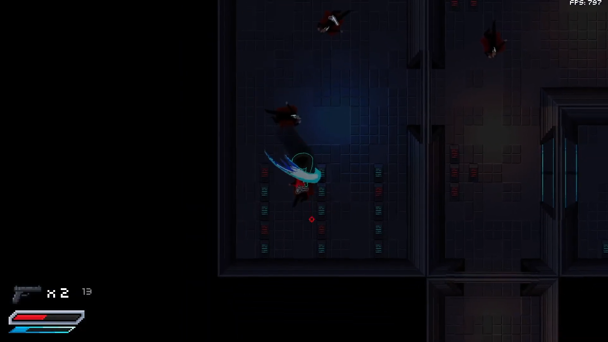
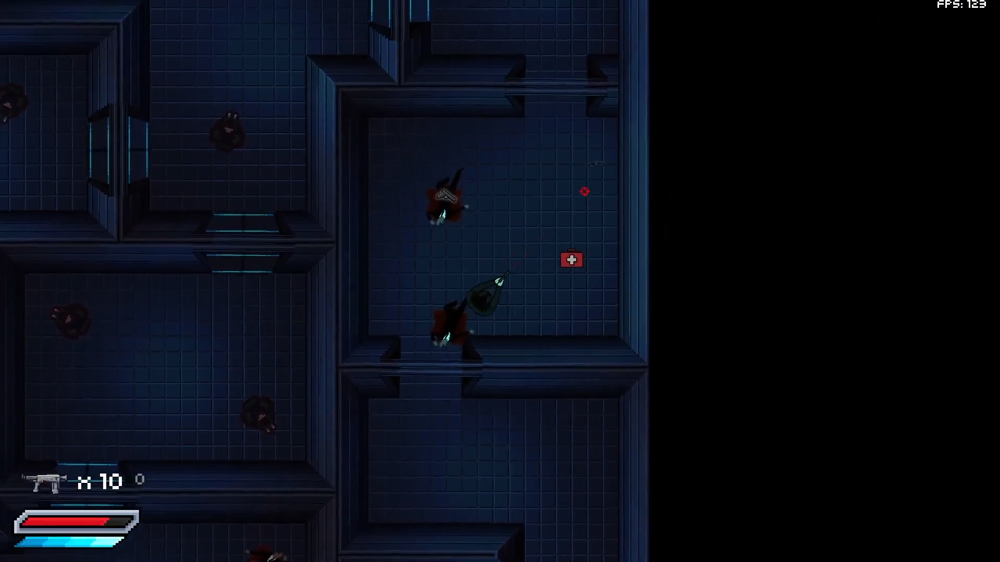
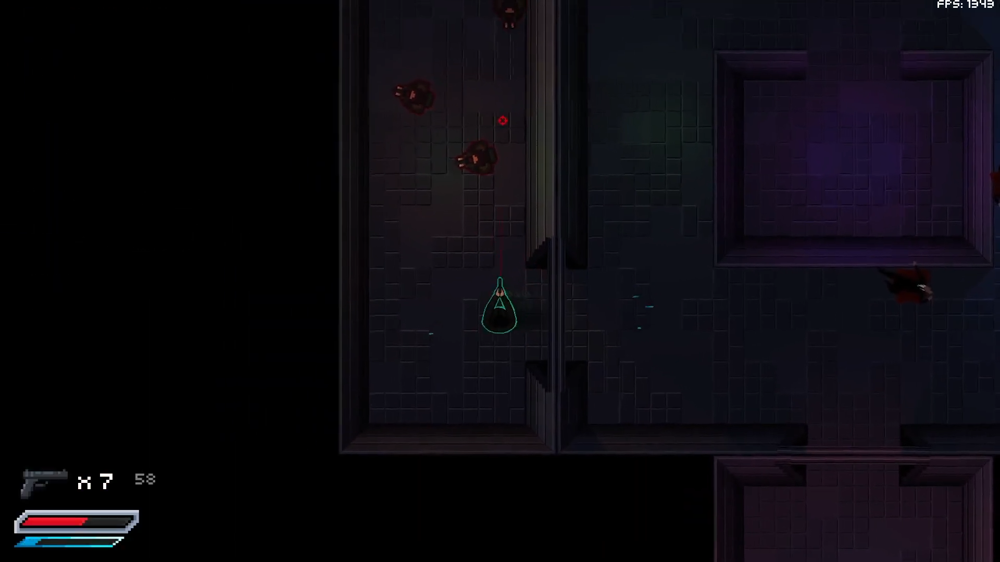

# Cyber-Yaga Vindicta
**Team Members:** Clive Yong, Parsa Saeedi, Jeff Kim, Matias Chomali, Mana Longhenry

A fast-paced, top-down 2.5D sci-fi shooter built in C++ with custom-built ECS architecture, dynamic lighting, smart enemy AI and immersive audio-visual design to deliver a fast tactical and action-packed gameplay experience.

## Key Technical highlights

- **Entity–Component–System (ECS) architecture**  
  - Gameplay entities (player, enemies, weapons, projectiles, props etc.) are composed from reusable components (transform, physics, health, AI, render, audio, etc.) using an ECS built from scratch, allowing systems to operate over component pools for cache-friendly iteration and easy extensibility.

- **Enemy AI with A\* pathfinding + decision trees**  
  - Enemies choose actions (patrol, pursue, shoot, retreat) based on a decision tree that considers health, distance, line of sight, and player state.  
  - A* pathfinding runs over a tile map; enemies path toward the player or the player’s last known position when line of sight is broken.

- **2.5D normal-mapped lighting + dynamic shadows**  
  - Walls, floors, and props use normal maps for non-uniform light reflection.  
  - Multiple light sources cast dynamic shadows from walls and geometry, creating a “2.5D” look despite using a 2D tile map.

- **Physics-inspired movement & collision**  
  - Player movement uses linear interpolation toward a target velocity for smooth acceleration/deceleration.  
  - Collision detection uses AABB, circle–circle, SAT (Separating Axis Theorem), and swept tests to handle fast-moving projectiles and rotated obstacles.

- **Rich audio feedback & game feel**  
  - Layered SFX for footsteps, weapon fire/reload, dashing, taking damage, enemy hits, pickups, door breaks, etc.  
  - Per-level music and impact sounds to enhance pacing and feedback.

- **Iterative game balance based on playtesting**  
  - Tuned enemy detection/attack ranges, aim inaccuracy, dash cooldown, weapon reload behavior, and health pickups based on cross-plays and test sessions.  

## Tech Stack

- **Language:** C++
- **Architecture:** Custom Entity–Component–System (ECS)
- **Rendering:** OpenGL-based renderer with custom framebuffers & normal mapping  
- **Math/Physics:** Custom collision system (AABB, SAT, circle), interpolation-based movement  
- **Audio:** in-engine audio system using mix of Zapsplat and Freesound assets 
- **Tools:** CMake, Visual Studio, Figma, Photoshop

## Screenshots

## My Contributions

This was a team project. Here are the parts I primarily focused on:

- **Gameplay & AI Systems (primary role)**
  - Acted as the primary gameplay programmer responsible for enemy AI systems and overall game feel.
  - Designed and implemented the AI decision-making pipeline, combining pathfinding, line-of-sight checks, and retreat behavior so enemies can patrol, pursue, shoot, and fall back intelligently.
  - Implemented player movement using interpolation-based acceleration/deceleration to keep controls smooth and responsive.
  - Worked on game balance, tuning enemy accuracy, detection ranges, dash behavior, health pickups, and weapon stats based on internal playtests and cross-plays.
  - Added a real-time FPS counter and other small debug/telemetry hooks to help with performance tuning and iteration.

- **AI Behavior & Game Feel**
  - Translated design ideas into concrete AI rules: when enemies should engage, hold position, or retreat depending on distance, health, and line of sight.
  - Integration of AI decisions with the animation, audio, and movement systems so enemy behavior feels readable and fair to the player.
  - Helped refine difficulty curves across levels by adjusting spawn compositions and enemy behaviors.

- **UI/UX & Player Feedback (secondary role)**
  - Took on a secondary UI/UX programmer role, leading team discussion and decisions about HUD layout, gameplay readability, and player-character feedback.
  - Designed and iterated on UI elements (health, ammo, crosshair, prompts) to keep the interface intuitive and uncluttered in a fast-paced top-down shooter.
  - Ensured that key states (reloading, taking damage, dash invulnerability) are clearly communicated through a mix of visuals and audio.

- **Audio, Visual Polish & Assets**
  - Helped integrate audio feedback for core actions (movement, firing, reloading, dashing, taking damage, pickups, doors breaking), focusing on responsiveness and impact.
  - Worked with textures and sprites for enemies, weapons, and UI, helping create, select and integrate assets to maintain a consistent visual style.

- **Project Management & Team Coordination (secondary role)**
  - Played a major role in project management alongside coding responsibilities: led the team in setting priorities, breaking down tasks on Jira boards, and keeping the project aligned with milestone goals.
  - Coordinated integration work through clear communication, planning and delegation to ensure features landed in time for check-ins and playtesting.
  - Contributed to documentation and presentation during milestones to clearly communicate the project’s systems and design decisions.

## Building the Game
1. Ensure a minimum of version 3.1 for CMake
2. Build the project using CMake
3. Run `cyber_yaga_vindicta.exe`

# Citations
## Textures:
- Enemy sprite: https://itch.io/queue/c/5235441/top-down-shooter?game_id=889128
- Guns: https://itch.io/queue/c/5235441/top-down-shooter?game_id=2065422
- Guns: https://itch.io/queue/c/5235441/top-down-shooter?game_id=3233191
- Wall Particles: https://nyknck.itch.io/fx062
- Health bar: https://bdragon1727.itch.io/basic-pixel-health-bar-and-scroll-bar
- Tileset: https://deakcor.itch.io/zelda-like-futuristic-tileset
- Wall particles: https://nyknck.itch.io/fx062
- Blood Splatter: https://bdragon1727.itch.io/free-smoke-fx-pixel-2
- Crosshair: https://en.m.wikipedia.org/wiki/File:Crosshairs_Red.svg
- Title screen: Made with ChatGPT and Figma
- Player sprite: Made by ChatGPT, edited with Pixquare and Figma
- Cutscenes: Made with ChatGPT, edited in Figma
- Dead enemy: Made manually in Figma
- Projectile: Made manually in Piskel and Figma
- Tutorial instructions: Made manually in Figma
- Muzzle flash: Manually made in Piskel and Figma
- Health box: Made manually in Figma
- Damage indicator: Made manually in Figma
- Laser: Manually made in Figma

## Audio
- Zapsplat (paid subscription):
    - Bullet_flyby
    - Bullet hit wall/brick/flesh/rock
    - Dash
    - Pistol shot, dry-fire, load, reload
    - Player hit
    - Railgun reload, shot, cock, dry-fire, 
    - Revolver shot, cock, dry-fire, reload
    - Shotgun shot, reload, cock
    - Slash (melee)
- Freesound.org:
    - Footstep: https://freesound.org/people/florianreichelt/sounds/459964/
    - Door breaking: https://freesound.org/people/qubodup/sounds/160213/
- Music:
    - Level0 song: https://youtu.be/MoLSQPtyLWE?si=Adyq-TSqofpCo6Bf
    - Level1 song: https://youtu.be/RpzKNnw1Jog?si=E3uo4Vo1StSkxuoP
    - Level2 song: https://www.youtube.com/watch?v=VEQ2oEnDYms
    - Level3 song: https://youtu.be/J_6HIlpkDCI?si=8lYtRmSThSUS3wEH
## Font
- Font: Rajdhani (available on Figma)
